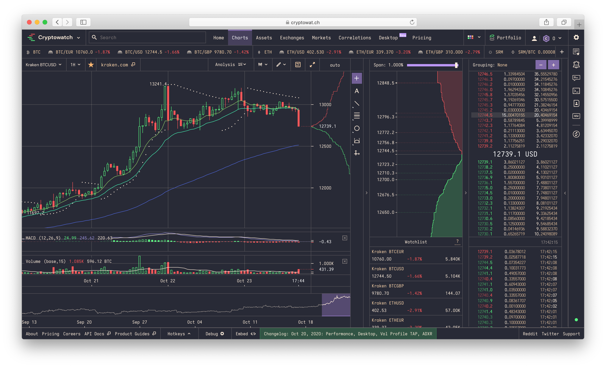

# Dracula for [Cryptowatch](https://cryptowat.ch/)

> A dark theme for [Cryptowatch](https://cryptowat.ch/).

## Install

All instructions can be found at [draculatheme.com/cryptowatch](https://draculatheme.com/cryptowatch).

## Team

This theme is maintained by the following person(s) and a bunch of [awesome contributors](https://github.com/dracula/cryptowatch/graphs/contributors).

 |
:---: |
[Diogo S.](https://github.com/diogorsergio) |

## License

[MIT License](./LICENSE)

